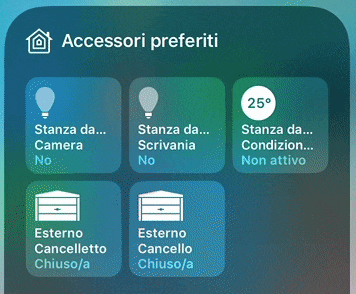

# Homebridge Tasmota Garage Door Opener

This is a [homebridge](https://github.com/nfarina/homebridge) plugin to connect with a Sonoff Relay Board with Tasmota firmware and open/close garage doors using HTTP requests via the Home app on iOS using Homekit.



Modified after https://github.com/atombarel/homebridge-tasmota-garage-opener for my needs.

Features are:

- Can set autoclosing timer
- Can set opening and closure timers different from each other
- Can set also 0 as openCloseTime, useful for doors or gates with locks that can be open but not closed again
- Can choose the relay to trigger (mapping done in index.js, don’t know if they are the same for every Sonoff)

Just add the following config to your homebridge config file located at this (default) path `~/.homebridge/config.json`.

```json
{
  "bridge": {
    "name": "Homebridge",
    "username": "CC:22:3D:E3:CE:50",
    "port": 51826,
    "pin": "031-45-154"
  },

  "description": "",

  "accessories": [
    {
      "accessory": "HTTP Tasmota Garage Door Opener",
      "name": "Garage Door",
      "ip": "192.168.0.85",
      "password": "",
      "doorRelayPin": 1,
      "openCloseTime": 15000,
      "openingTime": 15000,
      "closureTime": 15000,
      "timeBeforeClosure": 30000,
      "autoCloseByCommand": false
    }
  ],

  "platforms": []
}
```

openCloseTime - set if open and close time is identical
openingTime and closureTime - optional - if they are different (time that the gate takes to open and close)
timeBeforeClosure - used for autoclosing using same command after requiered timeBeforeClosure time, if autoCloseByCommand is set TRUE, it will send a close command after the specified time
autoCloseByCommand - false (false -> will NOT send a close command, in conjunction with timeBeforeClosure can be used to simulate the gate closing by itself after interval set by timeBeforeClosure)

Also a openCloseTime = 0 can be set for these doors/gates that have just a lock to open. The advantage of using this instead of a common switch is that Apple requires all security Homekit devices to ask for passcode / TouchID / FaceID before triggering this kind of devices.
No more wrong taps on the door unlock!

CREDITS for original plugin that I used as a template goes to @ankurp. Thank you man!
